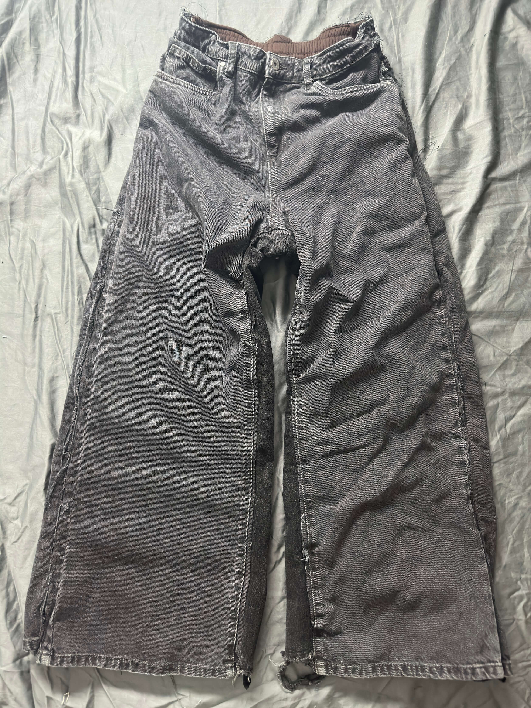
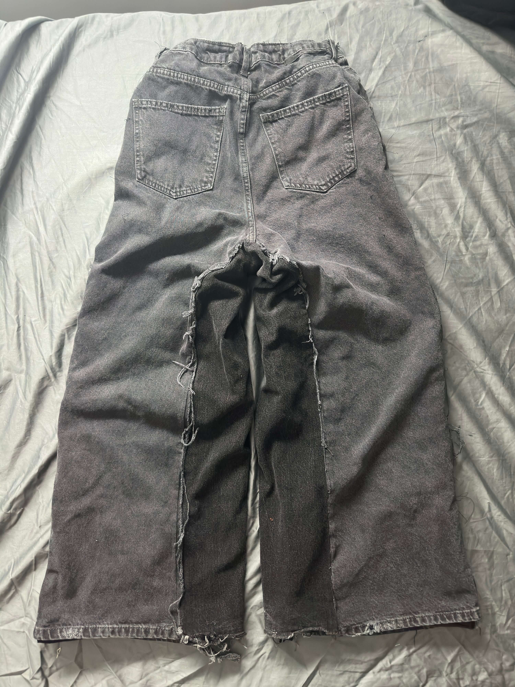

# Portfolio Piece 1: Black Jeans

<section class="grid">

<article class="grid">
    
    
</article>

For these jeans, I wanted to create the perfect baggy fitting jeans, so I first purchased a pair of jeans that were wide legged and a long front rise. Then I measured my desired leg opening and purchased another pair of jeans similar to the color of the first pair, then made my cut outs and combined them to create the jeans. Since I didn't like the way the garment draped, I lined the inside with 2 layers of sweatpants material to make it more sturdy and thick. Out of the dozens I've made, these are my favorite fitting jeans that I have ever created.



</section>